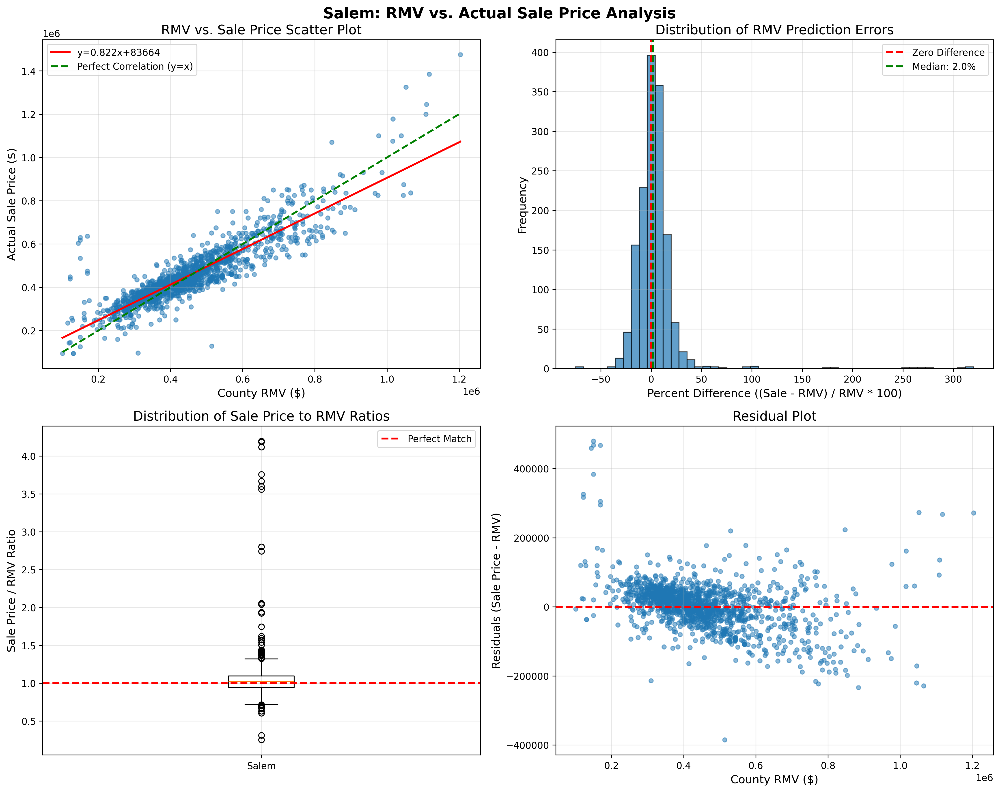
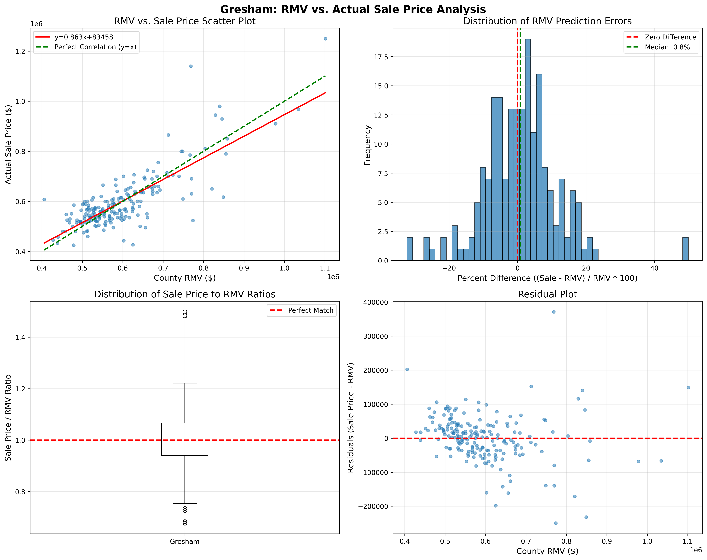
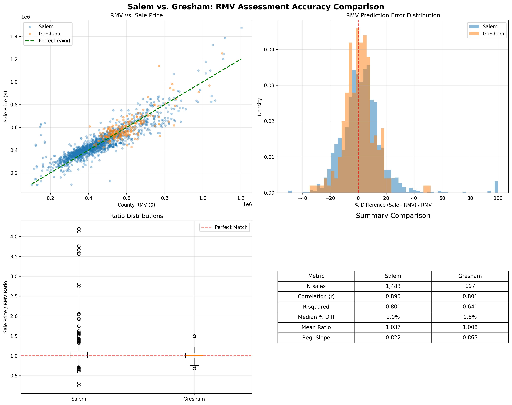
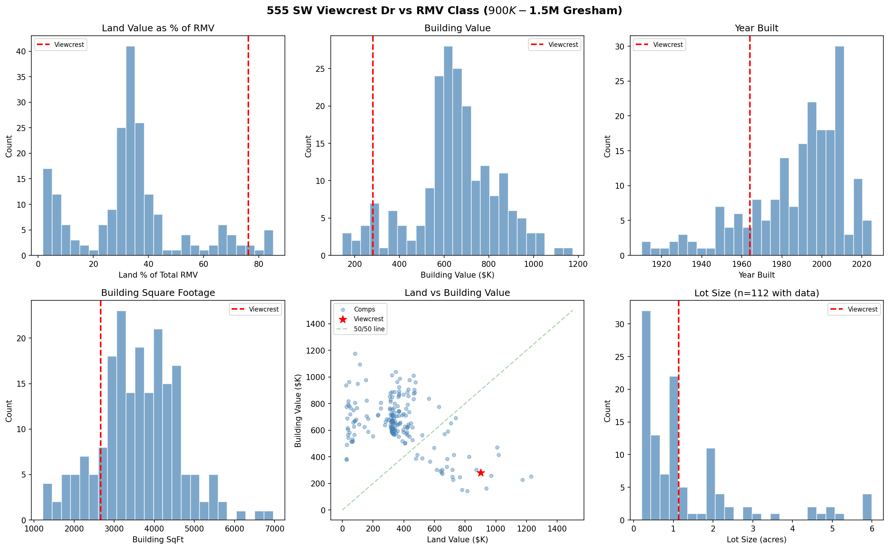
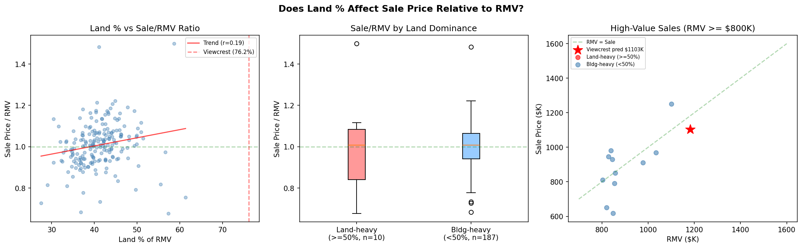
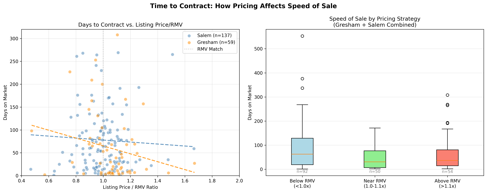

# View Crest Price Analysis
## A Data-Driven Analysis for Setting the Right Listing Price

> **Summary:** Analysis of 1,680 Oregon home sales shows county RMV estimates reliably predict actual sale prices (r = 0.80-0.90). Lower estimates for this property ($600K-$750K) appear driven by building-focused comp selection that underweights the $900K land parcel --- the land alone exceeds those estimates. The data supports a listing price of $1.1M-$1.25M with an expected timeline of several weeks to a few months.

### What We Investigated

Our home at 555 SW Viewcrest Dr will be for sale. Pricing opinions for this property range widely --- from initial estimates around $600K-$700K, to automated valuation models (Zillow, bank estimates) in the $750K range, to the county's assessed Real Market Value of $1.18M. That is an unusually wide gap, and it raised questions worth investigating before choosing a listing price.

We set out to answer:

- Are Multnomah County RMV estimates accurate predictors of actual sale prices?
- Does this property's unusual value composition (land-dominant) affect what buyers will pay?
- Why do different valuation approaches produce such different numbers for this property?
- How does listing price affect time to sell?

To answer these, we analyzed 1,680 actual home sales across two Oregon counties, 34 current for-sale listings, and 196 pending listings. The findings follow.

| | Salem (Marion County) | Gresham (Multnomah County) |
|--|--|--|
| **Source** | County sales records + ORCATS999 assessment data | Redfin sales + PortlandMaps ArcGIS assessments |
| **Sales filter** | Condition Code 33 (confirmed arms-length) | Existing homes only (excl. new construction) |
| **Sample** | 1,483 sales | 197 sales |
| **Period** | Jan 2024 - Feb 2026 | Feb 2025 - Feb 2026 |
| **Median sale price** | $428,000 | $570,000 |

---

### Part 1: County Assessments Are Reliable

Oregon counties assign every property a Real Market Value (RMV) used for taxation. How well does that number predict what a home actually sells for?

Both counties produce RMV estimates that correlate well with actual market prices. Salem shows strong correlation (r = 0.895) with a median difference of +2.0% --- homes sell slightly above RMV. Gresham tells a similar story (r = 0.801) with an even tighter error distribution (std dev 11% vs 25%), centered at +0.8% and statistically unbiased (p = 0.31).

Both counties show **assessment regressivity** --- a well-documented phenomenon in property taxation where lower-value homes sell above their RMV (the county undervalues them) while higher-value homes sell near or below their RMV. The regression slopes quantify this: Salem 0.82, Gresham 0.86. For every $1 increase in RMV, sale prices only increase by $0.82-$0.86. The two counties show remarkably similar patterns.

| Metric | Salem | Gresham |
|--------|------:|--------:|
| Correlation (r) | 0.895 | 0.801 |
| R-squared | 0.801 | 0.641 |
| Median % difference | +2.0% | +0.8% |
| Regression slope | 0.822 | 0.863 |
| Systematic bias? | Yes (slight, +2%) | No (p = 0.31) |

**Data quality matters enormously.** An early version of this analysis showed Gresham with a dismal r = 0.485. The culprit: 30 new construction homes whose county RMV reflected only the land value ($190K-$205K) before the house was completed, while the sale price reflected the finished home ($520K-$605K). Excluding new construction brought the correlation from 0.485 to 0.801. Similarly, Salem's correlation required filtering to Condition Code 33 (confirmed arms-length sales) --- without that filter, the correlation was only 0.55.

---

### Part 2: This Property's Unique Characteristics

We applied this analysis to our Gresham property: a 1964-built home on 1.13 acres with a 2025 RMV of $1,181,560. This property is unusual in its value composition --- 76% of the assessed value is land ($900,100), with only $281,460 attributed to the building. Among 199 Gresham residential properties in the $900K-$1.5M RMV class, this puts it at the 97th percentile for land dominance and the 5th percentile for building value. The typical property in this class gets two-thirds of its RMV from the building; this one is inverted.

Does this unusual composition affect what a buyer would pay? **The data says No.** Land-dominant properties (>=50% land) sold at a median ratio of 1.007 to RMV, while building-dominant properties sold at 1.008 --- statistically indistinguishable (Mann-Whitney p = 0.72). The market prices total value, not the breakdown between land and structure.

Among Gresham's 11 existing-home sales with RMV above $800K, sale-to-RMV ratios ranged from 0.73 to 1.17 --- a wider band than for typical homes, reflecting the scarcity of comparable sales at the high end. Four estimation methods converge on a predicted sale price of **$1.1M-$1.2M** for this property:

| Estimation Method | Predicted Sale Price |
|-------------------|---------------------:|
| Overall regression (slope 0.86) | $1,103,000 |
| High-value regression ($800K+) | $1,235,000 |
| Median high-value Sale/RMV ratio | $1,170,000 |
| Land-dominant median ratio | $1,190,000 |

---

### Part 3: Why Do Estimates Vary So Much?

The wide range of estimates --- from ~$700K to $1.2M --- is not a mystery once you understand what each method is keying on.

**Building-focused approaches produce lower numbers.** The county assesses this home's structure at $106/sqft, well below the $177/sqft class median. A comparable-sales approach that emphasizes building characteristics --- square footage, age, condition --- will naturally gravitate toward lower-priced comps, because the *building* is comparable to homes in the $400K-$600K range. This is a reasonable methodology for most homes, where the building represents 60-70% of value.

**Automated Valuation Models (AVMs) have the same blind spot.** Zillow, bank appraisal models, and similar tools weight building characteristics heavily. For a 1964-built, 2,660-sqft home, the algorithm finds comps with similar structures and produces an estimate around $750K. What the algorithm underweights is the 1.13-acre lot --- a parcel the county values at $900,100 and that has no subdivision potential (zoning requires 0.75 acres per lot).

**The data resolves this.** When we look at what buyers actually paid for Gresham properties across all value compositions, the land-to-building ratio has no statistical effect on sale price relative to RMV (p = 0.72). Buyers respond to total assessed value, not whether that value sits in the land or the building. The lower estimates are an artifact of comp-selection methodology, not a reflection of what this property would sell for.

This distinction matters because it points to a specific, testable claim: if building-focused comps are correct, we should see land-dominant properties selling well below RMV. They don't. The median sale-to-RMV ratio for land-dominant Gresham homes is 1.007 --- essentially RMV.

---

### Part 4: Pricing Strategy --- What Sellers Ask, What Buyers Pay, and How Long It Takes

#### What Sellers Ask vs. What Buyers Pay

An analysis of 34 current Gresham for-sale listings shows sellers systematically price 6.5% above RMV (statistically significant, p = 0.024), compared to the +0.8% median for actual closed sales. The ~6% gap is the negotiation room sellers build in and buyers negotiate away. The asking-price correlation with RMV is actually tighter (r = 0.924) than for sold prices (r = 0.801), confirming that sellers use the county's number as their anchor.

| Metric | Asking (34 listings) | Sold (197 sales) |
|--------|---------------------:|-----------------:|
| Median ratio to RMV | 1.065 | 1.008 |
| Median % above RMV | +6.5% | +0.8% |
| Correlation (r) | 0.924 | 0.801 |
| Regression slope | 1.284 | 0.863 |

The three land-heavy properties currently listed in Gresham (>=50% land value) are asking $850K-$1.5M. The two most comparable --- 2607 SW Pleasant View Dr (79% land, $1.24M RMV) and 5400 SE Chase Loop Rd (63% land, $1.38M RMV) --- are both listed at $1.5M.

For context, the lowest sale-to-RMV ratio in our 197-sale Gresham dataset was 0.677. Applied to this property, that worst-case scenario yields $800K.

| Benchmark | Implied Price |
|-----------|---------------------:|
| Worst sale in dataset (0.677 ratio) | $800,000 |
| Worst high-value sale (0.727 ratio) | $859,000 |
| County-assessed land value alone | $900,100 |
| Overall regression prediction | $1,103,000 |
| Median high-value sale ratio (0.990) | $1,170,000 |
| Current comparable asking prices | $1,250,000 - $1,500,000 |

#### How Pricing Affects Time to Contract

A reasonable concern about listing near $1.1M is that the higher price point could mean a longer wait. We analyzed 196 currently-pending Gresham and Salem listings to test this.

**Homes priced near RMV tend to go pending fastest.** In Gresham, the median time to contract for listings priced within 0-10% of RMV is **6 days** (n=14), compared to **22 days** (n=24) for listings priced more than 10% above RMV. Salem shows a similar but less pronounced pattern (44 vs 50 days). These sample sizes are modest --- the trend is directionally clear but the specific day counts should be taken as approximate.

| Pricing Strategy | Gresham Median DOM | Salem Median DOM | Combined |
|------------------|-------------------:|-----------------:|---------:|
| Near RMV (1.0 - 1.1x) | 6 days (n=14) | 44 days (n=36) | 30 days (n=50) |
| Above RMV (>1.1x) | 22 days (n=24) | 50 days (n=30) | 36 days (n=54) |

Listings currently priced *below* RMV show high days-on-market (median 62 days combined). This likely reflects selection bias rather than a causal effect: homes that sit unsold for months get price reductions, so currently-pending below-RMV listings are disproportionately stale listings that started higher. The takeaway is not "low prices sell slowly" but rather **"price correctly from day one to avoid chasing the market down."**

**For high-value Gresham homes specifically** ($800K+ RMV), only 5 are currently pending, with DOM ranging from 2 to 227 days. The sample is too small for reliable statistics, but the general pattern --- near-RMV pricing sells faster --- is consistent across price tiers.

**Note on Sample Size**: This pending analysis includes 196 listings (59 Gresham, 137 Salem) after excluding 22 new construction records with land-only assessments. High-value pending homes are scarce in both cities.

---

### Recommended Pricing Strategy

Based on the data, we recommend listing at **$1.1M - $1.25M**, with a plan for the likely buyer objection:

**A reasonable floor: $900K.** The county assesses the land alone at $900,100. Any price below that effectively gives away a 2,660-sqft building for free. Even setting aside all statistical analysis, the land value establishes a hard floor well above the lower estimates.

**Listing price: $1.1M - $1.25M** (near RMV, with ~6% negotiation room at the top end). This is consistent with what Gresham sellers ask and what the market data predicts.

**Anticipate the AVM objection.** Buyers and their agents will likely cite Zillow or bank estimates in the $750K range. The response is straightforward: those models undervalue land-dominant properties. Our data shows that land-dominant homes sell at the same ratio to RMV as building-dominant homes (p = 0.72). A professional appraisal emphasizing the 1.13-acre site and comparable land sales will be essential to justify the price to a lender.

**Expected timeline.** For high-value Gresham homes, comparable data is limited --- expect several weeks to a few months as a realistic range. Across all price tiers, homes priced near RMV go pending faster than those priced above or below, so pricing correctly from day one is the best way to minimize wait time. A Spring close (listing in February-March) aligns with the seasonal premium window (May sales close at 1.09x RMV vs January at 0.95x).

**Price reduction plan.** If no offers materialize within 45 days, a step-down to $1.05M remains well within the data-supported range and above the $900K land-value floor. This may attract buyers who are anchored to AVM estimates.

---

### Conclusions

1. **Oregon county assessments are reliable anchors.** Both Marion and Multnomah counties produce RMV estimates that correlate well with actual sale prices (r = 0.80-0.90). The median Gresham home sells at 1.008x RMV.

2. **The land-to-building ratio does not discount a property.** Buyers price total value. A 76%-land property sells at the same ratio to RMV as a 30%-land property (p = 0.72).

3. **Lower estimates appear to reflect a comp-selection limitation for land-dominant properties.** Building-focused approaches and AVMs underweight this property's $900K land value. The data shows land-dominant homes sell at the same ratio to RMV as building-dominant homes, suggesting the lower estimates understate this property's market value.

4. **Sellers anchor to RMV and mark up ~6.5%.** This is the negotiation room the market expects. Pricing significantly below RMV risks signaling a problem with the property and leaving substantial value uncaptured.

5. **Near-RMV pricing minimizes time on market.** Pending data shows homes priced within 10% of RMV go under contract faster than those priced above or below. Pricing correctly from day one avoids the costly cycle of sitting, reducing, and chasing the market down.

---

## Appendix

### Resolved Questions

We investigated several additional factors to ensure the pricing recommendation above is robust:

1. **Market Direction is Stable.** A trend analysis of Gresham sales over the past 12 months shows a correlation of **-0.060** between sale date and price/RMV ratio. This is effectively zero, indicating the market has been remarkably stable. Buyers are consistently paying near RMV regardless of the season.

2. **Seasonality Favors a Spring Listing.** While the overall trend is flat, monthly Gresham data shows a seasonal premium (n=8-29 sales per month):
   *   **January:** Median sale ratio 0.95x RMV (n=15)
   *   **May:** Median sale ratio **1.09x RMV** (n=17)
   *   Listing now (February) to target a Spring close aligns with the market's peak value window.

3. **No Subdivision Potential.** The property is in a City of Gresham overlay zone requiring 0.75 acres per lot. At 1.13 acres, the property cannot be subdivided. This confirms the buyer pool is residential owner-occupants, not developers, and reinforces the validity of using single-family home comparables rather than land-development comps.

4. **Property Condition.** The county assesses the building at $106/sqft --- well below the class median of $177/sqft. This gap is a legitimate reason to consider whether a buyer discount is warranted. However, specific improvements underway substantially narrow it: updated kitchen, new engineered wood flooring on main levels, new LVP flooring throughout the basement (replacing damaged tile), a new electrical panel replacing a Federal Pacific unit (a known safety hazard and common inspection deal-killer), and resolution of other known maintenance items. These address the most common buyer concerns for a 1960s-era home and reduce the likelihood of significant inspection concessions. The building assessment alone does not justify pricing below $900K --- the county-assessed land value. Even conservatively valued, the improved building adds meaningfully above the land floor.

### Remaining Unanswered Questions

1.  **Interest rate sensitivity.** High-value homes are sensitive to interest rates. While our recent data accounts for current market conditions, a rate spike could dampen the $1M+ buyer pool.

2.  **AVM divergence.** Zillow and bank AVMs appear to estimate this property in the $750K range. This is likely because their algorithms weight building characteristics over land value. A professional appraisal that properly values the 1.13-acre site will be critical for lender approval.

---

### Methodology

- **Salem sold homes**: Marion County sales CSVs (2024-2025) filtered to Condition Code 33, joined with ORCATS999 comprehensive assessment data on Account Number. Total RMV = RMVLAND + RMVIMPR.
- **Gresham sold homes**: Redfin recently-sold CSVs enriched with Multnomah County RMV from PortlandMaps ArcGIS REST service. Addresses matched automatically (99% exact match rate). New construction (built 2024+) excluded. RMV = LANDVAL + BLDGVAL from closest assessment year to sale date.
- **Asking prices**: Redfin for-sale listing CSVs (Feb 2026) for Gresham, enriched with county RMV data.
- **Pending listings (time to contract)**: Redfin pending-status CSVs for Gresham (59 listings) and Salem (137 listings), enriched with county RMV. New construction excluded (22 Gresham records with no building assessment). Days on market is cumulative from original listing date.
- **Statistics**: Pearson correlation, OLS regression, Spearman rank correlation, Mann-Whitney U test, one-sample t-test for bias detection. All analysis in Python (pandas, scipy, matplotlib).
